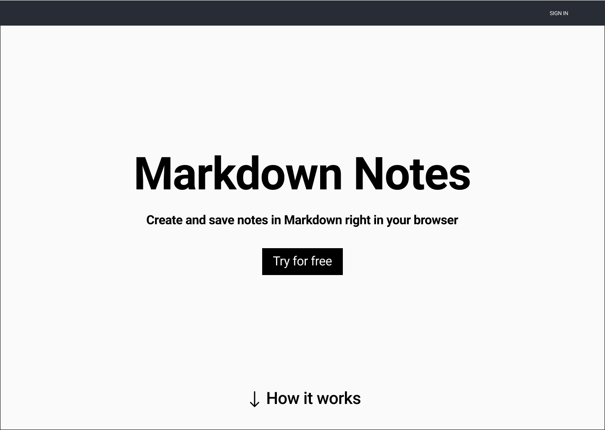
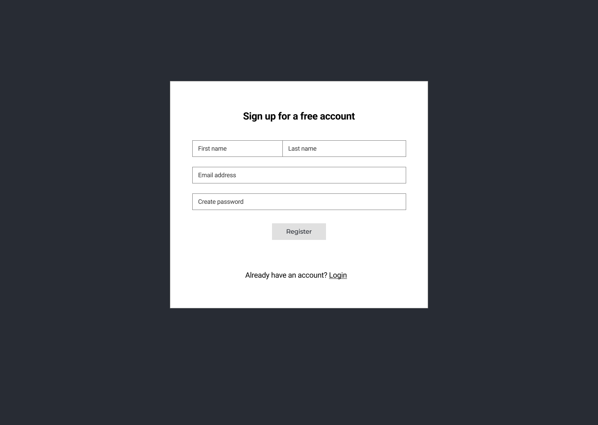
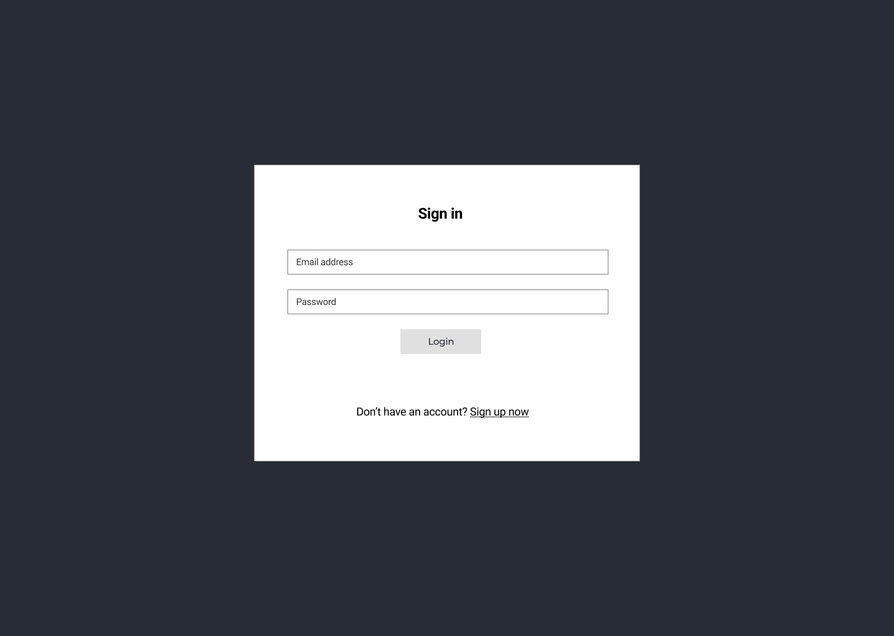
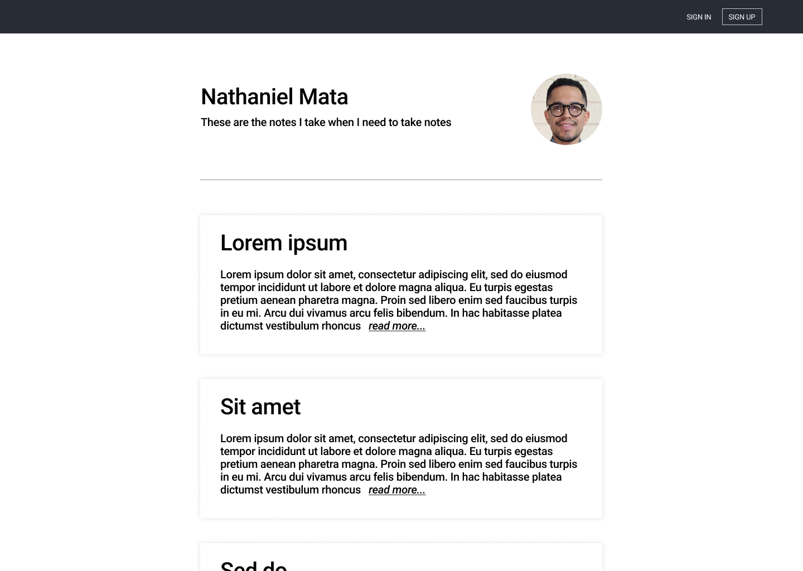

# Markdown Notes Capstone 

'Markdown Notes' is a note taking app that lets you create notes in a markdown editor and preview the html output, then save the note to your user account.  

# Features  

- Take notes using basic markdown syntax
- Save notes to an account
- Delete notes from an account
- Preview the html output of your markdown

## Technology  

- Front-End: HTML5, CSS3, JavaScript ES6, React
- Back-End: Node.js, Express.js, Mocha, Chai, RESTful API Endpoints, Postgres
- Prodcution Environment: Heroku, Vercel

## Working Prototype  

You can access a working prototype of the:

  React(Client) app here:  
    https://markdown-notes-capstone-client.vercel.app  
    
  Node/Express(Server) API here:  
    https://infinite-sea-85899.herokuapp.com/api  

## User Stories  

This app is for two types of users: a REGISTERED USER and an UNREGISTERED USER  

#### Landing Page  

- as a REGISTERED USER
- I want to go to a landing page that introduces the app and explains its features and provides links to sign-in page, sign-up page.
- So I can learn more about the app and how it works

---

#### Login  

- as a REGISTERED USER
- I want to login to my account with my unique username and password and start a logged in session
- So I can view my user dashboard and decide where to navigate in my account

---

#### How-to page  

- as an UNREGISTERED/REGISTERED USER
- I want to go to a How-to page to help me understand how to use the app
- So I can effectively use the app

---

#### User dasboard page  

- as a REGISTERED USER
- I want to view my user dashboard
- So I can view and search a list of my saved Markdown notes

---

#### User dasboard page(Logout)  

- as a REGISTERED USER
- I want to logout of my account
- So I can limit access to my account

---

#### User new note page  

- as a REGISTERED USER
- I want to create a new Markdown note
- So I can edit and save the Markdown note in the editor while previewing the output HTML

---

#### User edit note page  

- as a REGISTERED USER
- I want to edit a saved Markdown note
- So I can save the Markdown note in the editor while previewing the output HTML

### Wireframes

Landing Page  
:-------------------------:

Sign up Page
:-------------------------:

Login Page  
:-------------------------:

User public Page  
:-------------------------:

User dashboard `new doc` Page
:-------------------------:

| User dashboard `notes list` Page                                                                  | Mobile                                                                                                   |
| ------------------------------------------------------------------------------------------------- | -------------------------------------------------------------------------------------------------------- |
|  |  |

| User dashboard `editor` Page                                                               | Mobile Editor                                                                                         | Mobile Preview                                                                                         |
| ------------------------------------------------------------------------------------------ | ----------------------------------------------------------------------------------------------------- | ------------------------------------------------------------------------------------------------------ |
|  |  |  |

User dashboard `export dropdown` Page  
:-------------------------:

User dashboard `user preferences dropdown` Page  
:-------------------------:

## Screenshots

Landing Page
:-------------------------:

Dashboard Page
:-------------------------:

Sign-in Page
:-------------------------:

Edit Note Page
:-------------------------:

New Note Page
:-------------------------:

Sidebar
:-------------------------:

## API Documentation 

POST /api/auth/login  
- post's a user's credentials for login

GET /api/notes  
- get a user's notes  

POST /api/notes  
- post a new note

GET /api/notes/:id  
- get a note by id

DELETE /api/notes/:id  
- delete a note by id

PATCH /api/notes/:id  
- update a note by id

## Responsive

App is built to be usable on mobile devices, as well as responsive across mobile, tablet, laptop, and desktop screen resolutions.

## Development Roadmap (later)

This is v1.0 of the app, but future enhancements are expected to include:

- allow users to register
- enable users to view and create notes without having to login
- allow users to make private notes public
- extend markdown support beyond basic syntax 
- allow users to export .md or .html file
- search notes  
- tagging notes 

## How to run it

Use command line to navigate into the project folder and run the following in terminal

### Local Server/Node scripts

- clone repo https://github.com/nathanielmata/markdown-notes-capstone-server
- To install the node project ===> npm install
- To migrate the database ===> npm run migrate -- 1
- To run Node server (on port 8000) ===> npm run dev
- To run tests ===> npm run test

### Local Client/React scripts

- clone repo https://github.com/nathanielmata/markdown-notes-capstone-client
- To install the react project ===> npm install
- To run react (on port 3000) ===> npm start
- To run tests ===> npm run test
