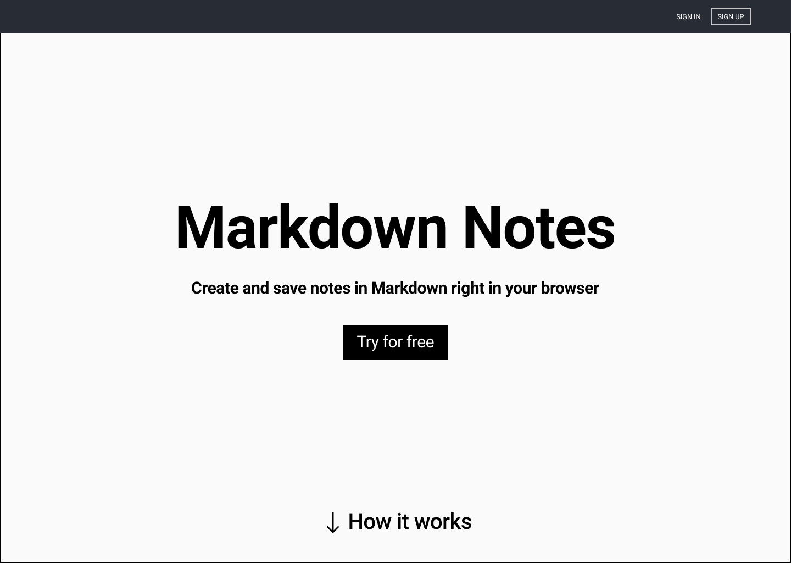

# Markdown Notes Capstone (done)

Note taking app that formats your text to markdown

## Working Prototype (later)

You can access a working prototype of the React app here: https://your-app-client.herokuapp.com/ and Node app here: https://your-app-server.herokuapp.com/

## User Stories???

This app is for two types of users: a REGISTERED USER and an UNREGISTERED USER

#### Landing Page

- as an UNREGISTERED USER
- I want to write a note in a Markdown editor while previewing the output HTML
- So I can save my note as a Markdown or HTML file to my computer

---

#### Login/Signup Page

- as an UNREGISTERED USER
- I want to create an account with a username and password
- So I can save notes to my account

---

#### User Public Page

- as an UNREGISTERED USER
- I want to see a list of public notes saved to a REGISTERED USER account from a unique url
- So I can read a public note in Markdown or HTML in a browser

---

#### Login/Signup Page

- as a REGISTERED USER
- I want to login to my account with my unique username and password and start a logged in session
- So I can view my user dashboard and decide where to navigate in my account

---

#### User dasboard page

- as a REGISTERED USER
- I want to view my user dashboard
- So I can see a list of my saved notes in Markdown

---

#### User dasboard page

- as a REGISTERED USER
- I want to logout of my account
- So I can limit access to my account

---

#### User dasboard page

- as a REGISTERED USER
- I want to retrieve a unique url that lists where all my public notes are displayed
- So I can share the url with collaborators

---

#### User profile page

- as a REGISTERED USER
- I want to view my profile
- So I can edit my password

---

#### User new note page

- as a REGISTERED USER
- I want to create a new note
- So I can edit and save the note in Mardown while previewing the output HTML

---

#### User edit note page

- as a REGISTERED USER
- I want to view an existing note
- So I can edit and save the note in Mardown while previewing the output HTML

---

#### User new & edit note page

- as a REGISTERED USER
- I want to make a note public
- So anyone can view a note from a unique URL in a web browser

### Wireframes???

Landing Page  
:-------------------------: 

Sign up Page
:-------------------------:

Login Page  
:-------------------------:

User public Page  
:-------------------------: 

User dashboard `new doc` Page  
:-------------------------: 

User dashboard `notes list` Page  
:-------------------------: 

User dashboard `export dropdown` Page  
:-------------------------: 

User dashboard `user preferences dropdown` Page  
:-------------------------: 

## Screenshots (later)

Landing/Login Page
:-------------------------:

Landing/Register Page

## Functionality???

The app's functionality includes:

- Every User has the ability to create an account

## Technology (done)

- Front-End: HTML5, CSS3, JavaScript ES6, React
- Back-End: Node.js, Express.js, Mocha, Chai, RESTful API Endpoints, Postgres
- Development Environment: Heroku, DBeaver

## Front-end Structure - React Components Map (later)

- **Index.js** (stateless)
  - **App.js** (stateful)
    - **LandingPage.js** (stateful) - gets the _"prop name"_ and the _"callback prop name"_ from the **App.js**
      - **Login.js** (stateful) -
      - **Register.js** (stateful) -
    - **Navbar.js** (stateless) -

## Back-end Structure - Business Objects (later)

- Users (database table)
  - id (auto-generated)
  - username (email validation)
  - password (at least 8 chars, at least one alpha and a special character validation)

## API Documentation (later)

API Documentation details:

- get all users

## Responsive (done)

App is built to be usable on mobile devices, as well as responsive across mobile, tablet, laptop, and desktop screen resolutions.

## Development Roadmap (later)

This is v1.0 of the app, but future enhancements are expected to include:

- add more functionality

## How to run it (done)

Use command line to navigate into the project folder and run the following in terminal

### Local Node scripts

- To install the node project ===> npm install
- To migrate the database ===> npm run migrate -- 1
- To run Node server (on port 8000) ===> npm run dev
- To run tests ===> npm run test

### Local React scripts

- To install the react project ===> npm install
- To run react (on port 3000) ===> npm start
- To run tests ===> npm run test
