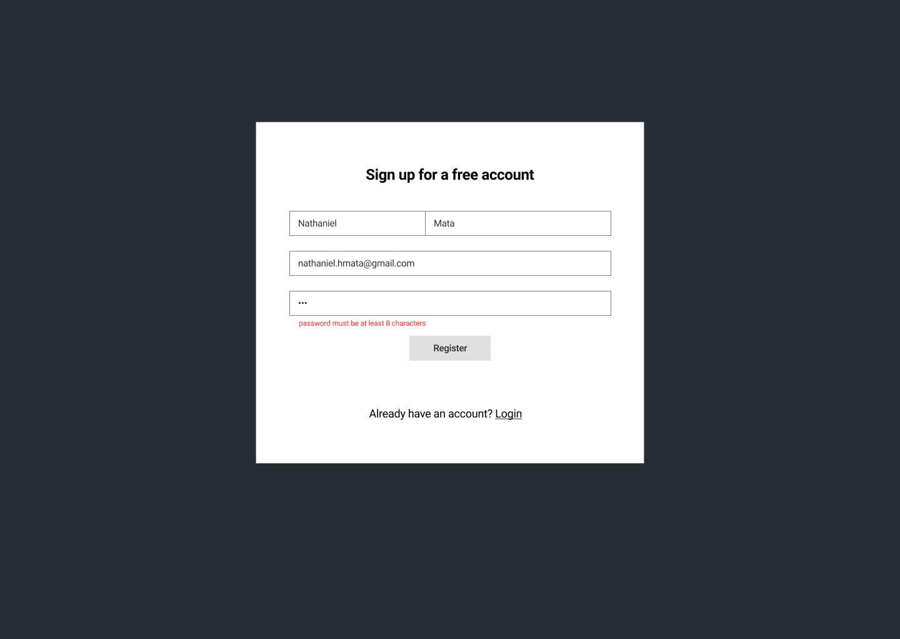

# Markdown Notes Capstone 

'Markdown Notes' is a note taking app that lets you create notes in a markdown editor and preview the html output, then save the note to your user account where you can tag the note as public or private.

Context: I'm always taking notes, but my notes are a mess (show my messy notes). I decided to use Markdown to write my notes for visual organization.

Wireframes/Screenshots

Features: I created the Markdown Notes app to organize notes
- write
- preview
- save
- edit
- search(pending)
- tag(pending)

Tech Stack:
- Front-End: HTML5, CSS3, JavaScript ES6, React
- Back-End: Node.js, Express.js, Mocha, Chai, RESTful API Endpoints, Postgres
- Development Environment: Heroku, Vercel

Demo:
- https://markdown-notes-capstone-client.vercel.app

Lessons Learned: 
- it can be hard to deal with multiple contexts in a single component

What would I do differently:
- use uuid for note routing ids rather than incremented integer
- consolidate buttons in editor into a dropdown
- break up list data loading(lazy loading until user scrolls)

Additional features:
- search
- tagging notes
  - tags table in database
- indicators and transitions for users
- user public page for notes marked public
- export .md or .html file

## Working Prototype

You can access a working prototype of the React app here: https://markdown-notes-capstone-client.vercel.app and Node api app here: https://infinite-sea-85899.herokuapp.com/api

## User Stories???

This app is for two types of users: a REGISTERED USER and an UNREGISTERED USER

#### Landing Page

- as an UNREGISTERED USER/REGISTERED USER
- I want to go to a landing page that introduces the app and explains its features and provides links to sign-in page, sign-up page and the try-it-out editor.
- So I can learn more about the app and how it works

---

#### Landing Page

- as an UNREGISTERED USER
- I want to try out the editor without registering and create a note in a Markdown editor while previewing the output HTML
- So I can export my note as a Markdown or HTML file to my computer

---

#### Login/Signup Page

- as an UNREGISTERED USER
- I want to create an account with a username and password
- So I can save notes to my account

---

#### User Public Page

- as an UNREGISTERED USER
- I want to see a list of public notes saved to a REGISTERED USER account from a unique url
- So I can read a public note in Markdown or HTML in a browser

---

#### FAQ/Help page

- as a UNREGISTERED/REGISTERED USER
- I want to go to an FAQ page to help me understand how to use the app
- So I can effectively use the app

---

#### Login

- as a REGISTERED USER
- I want to login to my account with my unique username and password and start a logged in session
- So I can view my user dashboard and decide where to navigate in my account

---

#### User dasboard page

- as a REGISTERED USER
- I want to view my user dashboard
- So I can view and search a list of my saved Markdown notes

---

#### User dasboard page

- as a REGISTERED USER
- I want to logout of my account
- So I can limit access to my account

---

#### User dasboard page

- as a REGISTERED USER
- I want to generate a unique url where my public notes can be viewed on the open web
- So I can share the url with anyone

---

#### User profile page

- as a REGISTERED USER
- I want to view my profile
- So I can edit my password, username, user email and name displayed on my public page

---

#### User new note page

- as a REGISTERED USER
- I want to create a new Markdown note
- So I can edit and save the Markdown note in the edotor while previewing the output HTML

---

#### User edit note page

- as a REGISTERED USER
- I want to search for and view a saved note
- So I can edit and save the note in Markdown while previewing the output HTML

---

#### User new & edit note page

- as a REGISTERED USER
- I want to make a Markdown note public
- So anyone can view a note from a unique URL in a web browser

### Wireframes???

Landing Page  
:-------------------------:

Sign up Page
:-------------------------:

Login Page  
:-------------------------:

User public Page  
:-------------------------:

User dashboard `new doc` Page
:-------------------------:

| User dashboard `notes list` Page                                                                  | Mobile                                                                                                   |
| ------------------------------------------------------------------------------------------------- | -------------------------------------------------------------------------------------------------------- |
|  |  |

| User dashboard `editor` Page                                                               | Mobile Editor                                                                                         | Mobile Preview                                                                                         |
| ------------------------------------------------------------------------------------------ | ----------------------------------------------------------------------------------------------------- | ------------------------------------------------------------------------------------------------------ |
|  |  |  |

User dashboard `export dropdown` Page  
:-------------------------:

User dashboard `user preferences dropdown` Page  
:-------------------------:

## Screenshots (later)

Landing/Login Page
:-------------------------:

Landing/Register Page

## Functionality???

The app's functionality includes:

- Every User has the ability to create an account

## Technology

- Front-End: HTML5, CSS3, JavaScript ES6, React
- Back-End: Node.js, Express.js, Mocha, Chai, RESTful API Endpoints, Postgres
- Development Environment: Heroku, Vercel

## Front-end Structure - React Components Map (later)

- **Index.js** (stateless)
  - **App.js** (stateful)
    - **LandingPage.js** (stateful) - gets the _"prop name"_ and the _"callback prop name"_ from the **App.js**
      - **Login.js** (stateful) -
      - **Register.js** (stateful) -
    - **Navbar.js** (stateless) -

## Back-end Structure - Business Objects (later)

- Users (database table)
  - id (auto-generated)
  - username (email validation)
  - password (at least 8 chars, at least one alpha and a special character validation)

## API Documentation (later)

API Documentation details:

- get all users

## Responsive (done)

App is built to be usable on mobile devices, as well as responsive across mobile, tablet, laptop, and desktop screen resolutions.

## Development Roadmap (later)

This is v1.0 of the app, but future enhancements are expected to include:

- add more functionality

## How to run it (done)

Use command line to navigate into the project folder and run the following in terminal

### Local Node scripts

- To install the node project ===> npm install
- To migrate the database ===> npm run migrate -- 1
- To run Node server (on port 8000) ===> npm run dev
- To run tests ===> npm run test

### Local React scripts

- To install the react project ===> npm install
- To run react (on port 3000) ===> npm start
- To run tests ===> npm run test
